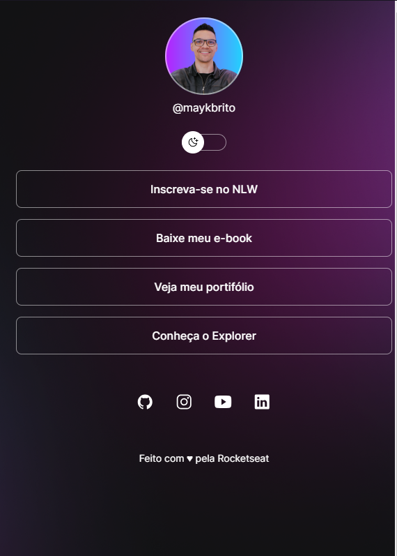

# discover
<h1>Discover</h1>

Fazendo o curso da Rocketseat Discover
Bem esta aplicação é consertrada em criar um ambiente mas permitindo que elá tenha dois temas um Dark e um light.
A codificação do JS é basicamente consentrado nisso.

&copy;&nbsp;Discover

## Tecnologias

Este projecto foi desenvolvido nas seguintes tecnologias:
-HTML & CSS;
-JavaScript;
-Git & GitHub;
-Figma.

## Layout

Voçe pode ter acesso a este projecto pelo pelo figma através [desse link](https://www.figma.com/file/dA62XDktQgTGzBXeo6gvPq/DevLinks-%E2%80%A2-Projeto-Discover-(Community)?type=design&node-id=10-620&mode=design&t=j1udksTdUtjGlHTD-0)